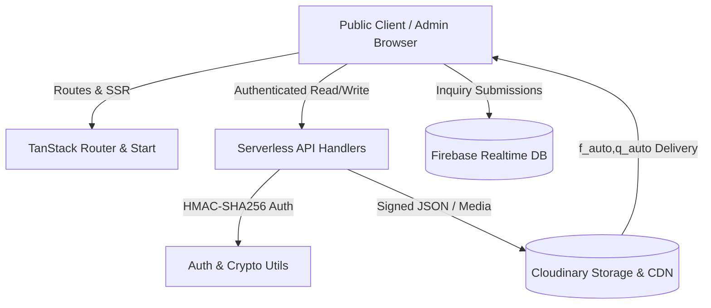

# GURMITRAA — Official Platform & CMS

<div align="center">


**Software Product Development & IT Consulting Studio**

[](https://www.gurmitraa.com)
[](https://react.dev/)
[](https://www.typescriptlang.org/)
[](https://vitejs.dev/)
[](https://tanstack.com/router)
[](https://tailwindcss.com/)
[](https://cloudinary.com/)
[](https://firebase.google.com/)

</div>

---

## 🌟 Overview

**GURMITRAA** is a digital product development studio engineering scalable SaaS applications, cloud infrastructure, enterprise platforms, and IT consulting solutions.

This repository powers the official **[gurmitraa.com](https://www.gurmitraa.com)** website and its built-in **Real-Time Content Management System (CMS)**.

---

## 🚀 Key Features

### 🏢 Public Studio Platform
- **Hero & Interactive 3D Canvas**: Sleek animations and cursor interactions powered by `motion` and Tailwind CSS v4.
- **Dynamic Services & Solutions**: Modular listings for Web, Mobile, Cloud, AI/ML, and SaaS engineering.
- **Interactive Multi-Step Inquiry Form**: Multi-step client onboarding flow with bot honeypot protection, streaming inquiries directly into Firebase Realtime Database.
- **Interactive Products & Portfolio**: Live case studies and SaaS product showcases with dynamic filters.
- **Real-Time SEO & Metadata Engine**: Dynamic OpenGraph, Twitter Cards, and canonical tags for every page.

### ⚡ Integrated Admin CMS & Dashboard
- **Cloudinary JSON CMS**: All page content, section structures, and global branding reside directly in **Cloudinary raw JSON documents** (`gurmitraa/cms/*.json`).
- **Cryptographic HMAC-SHA256 Auth**: Server-side token signing and constant-time verification with zero plaintext credentials in client bundles.
- **Recursive Section Editor**: Customize every heading, paragraph, button label, icon, and nested array with live preview and debounced draft management.
- **Secure Media Manager**:
  - Direct media upload to dedicated Cloudinary folder (`gurmitraa`).
  - Automatic `f_auto,q_auto` CDN delivery optimization.
  - Built-in **Reference Safety Check** (scans Cloudinary CMS documents to prevent accidental deletion of images in use).
  - Media picker integrated across all CMS field editors.
- **One-Click Factory Reset & Backups**:
  - Automatic local snapshot backups prior to reset.
  - Per-page reset and global site reset back to canonical defaults.

---

## 🛠️ Architecture & Tech Stack



### Core Technologies
- **Frontend Framework**: [React 19](https://react.dev/) + [TypeScript](https://www.typescriptlang.org/)
- **Routing & SSR**: [TanStack Router](https://tanstack.com/router) & [TanStack Start](https://tanstack.com/start)
- **Styling & UI**: [Tailwind CSS v4](https://tailwindcss.com/), [Radix UI](https://www.radix-ui.com/), [Lucide React](https://lucide.dev/)
- **Animations**: [Motion](https://motion.dev/) (Framer Motion v12)
- **CMS & Media Engine**: [Cloudinary](https://cloudinary.com/) (Node.js SDK + Signed REST endpoints)
- **Form Submissions**: [Firebase Realtime Database](https://firebase.google.com/)
- **Build Tool**: [Vite 7](https://vitejs.dev/)
- **Deployment**: [Vercel](https://vercel.com/) / [Cloudflare Workers](https://workers.cloudflare.com/)

---

## 📂 Project Structure

```
Gurmitraa/
├── api/                       # Production Serverless Functions
│   ├── admin-login.js         # HMAC session login endpoint
│   ├── admin-verify.js        # Serverless session verification guard
│   ├── auth-utils.js          # Timing-safe HMAC & crypto utils
│   ├── cms-read.js            # Public Cloudinary CMS fetch
│   ├── cms-write.js           # Authenticated Cloudinary CMS write
│   ├── cloudinary-upload.js   # Authenticated Cloudinary asset upload
│   ├── cloudinary-delete.js   # Authenticated Cloudinary asset destroy
│   └── cloudinary-sign.js     # Direct-upload signature generator
├── dev-api/                   # Local Development API Proxy
│   └── server.cjs             # Node.js dev server with Cloudinary SDK
├── src/
│   ├── components/            # Reusable UI & Layout Components
│   │   ├── Navbar.tsx         # Real-time navigation bar
│   │   ├── Footer.tsx         # Global footer
│   │   └── PageShell.tsx      # Page layout wrappers & animations
│   ├── lib/                   # Core Services & Helpers
│   │   ├── admin-auth.ts      # Admin session & API integration
│   │   ├── cms.ts             # Cloudinary CMS service layer
│   │   ├── cms-defaults.ts    # Canonical factory templates
│   │   ├── cms-schema.ts      # Zod runtime validation schemas
│   │   ├── cloudinary.ts      # Cloudinary client SDK & CDN transforms
│   │   ├── firebase.ts        # Firebase app initialization
│   │   └── media.ts           # Media asset manager & reference checker
│   └── routes/                # TanStack File-Based Routes
│       ├── __root.tsx         # Root layout with global context
│       ├── index.tsx          # Home page
│       ├── about.tsx          # About page
│       ├── services.tsx       # Services & offerings
│       ├── products.tsx       # SaaS products
│       ├── portfolio.tsx      # Case studies & client work
│       ├── contact.tsx        # Contact & multi-step inquiry
│       └── admin.tsx          # Recursive CMS Admin Dashboard
├── .env.example               # Environment variables template
├── package.json
└── vite.config.ts
```

---

## ⚡ Getting Started

### 1. Clone the Repository
```bash
git clone https://github.com/gurmitraa/Gurmitraa.git
cd Gurmitraa
```

### 2. Install Dependencies
```bash
npm install
```

### 3. Configure Environment Variables
Copy `.env.example` to `.env` and fill in your credentials:
```bash
cp .env.example .env
```

### 4. Run Development Servers
In two separate terminals:
```bash
# Terminal 1: Dev API Server (Port 8787)
npm run dev:api

# Terminal 2: Vite Dev Server (Port 8080)
npm run dev
```
Open [http://localhost:8080](http://localhost:8080) in your browser.

---

## 🚢 Building & Deployment

### Type Check & Production Build
```bash
# Type check TypeScript
npx tsc --noEmit

# Lint codebase
npm run lint

# Compile client & SSR bundles
npm run build
```

### Deploying to Vercel
1. Connect your repository to **Vercel**.
2. Configure the environment variables in your Vercel Project Settings:
   - `ADMIN_JWT_SECRET`
   - `MASTER_PASSWORD`
   - `CLOUDINARY_CLOUD_NAME`
   - `CLOUDINARY_API_KEY`
   - `CLOUDINARY_API_SECRET`
   - `CLOUDINARY_UPLOAD_FOLDER`
   - `VITE_FIREBASE_*` variables
3. Deploy!

---

## 📄 License & Ownership

© 2026 **GURMITRAA**. All rights reserved.  
Crafted with precision for modern digital businesses.
